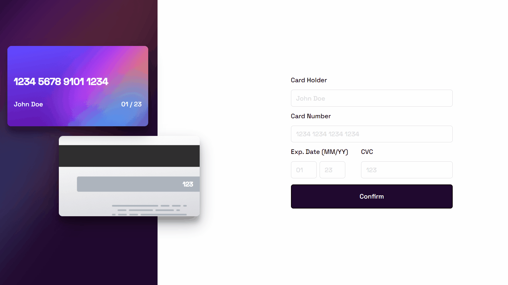

<h1 align="center"> Coffe Delivery</h1>

<p align="center">
  <a href="#tech">Tech</a>&nbsp;&nbsp;&nbsp;|&nbsp;&nbsp;&nbsp;
  <a href="#project">Projeto</a>&nbsp;&nbsp;&nbsp;|&nbsp;&nbsp;&nbsp;
  <a href="#getting-started">Getting Started</a>
</p>


## Project 

Your users should be able to:

- Fill in the form and see the card details update in real-time
Receive error messages when the form is submitted if:
- Any input field is empty
- The card number, expiry date, or CVC fields are in the wrong format
- View the optimal layout depending on their device's screen size
- See hover, active, and focus states for interactive elements on the page

For this project I did'nt put live because of possible alerts as the project is based on credit card visualizing. If you want to see working you can follow the instructions below. 

Here an gif of the working project:




## Tech

- React
- Typescript
- Styled-components

## What I learn when I was building?

I learn about [type assertions](https://www.typescriptlang.org/docs/handbook/2/everyday-types.html#type-assertions) sometimes we know some information that typescript can’t know. 

In this case the target is always a ```HTMLInputElement``` so I had to specify using type assertion:

```js
function handleChange(e: FormEvent) {
    const target = e.target as HTMLInputElement;

    setCardData({
      ...cardData,
      [target.name]: target.value,
    });
  }
```

## Getting Started

Clone the project and access the folder.

```
git clone https://github.com/filipesaretta/card-interactive

cd card-interactive
```

Install the dependencies and start.

```
npm install

npm run dev
```


